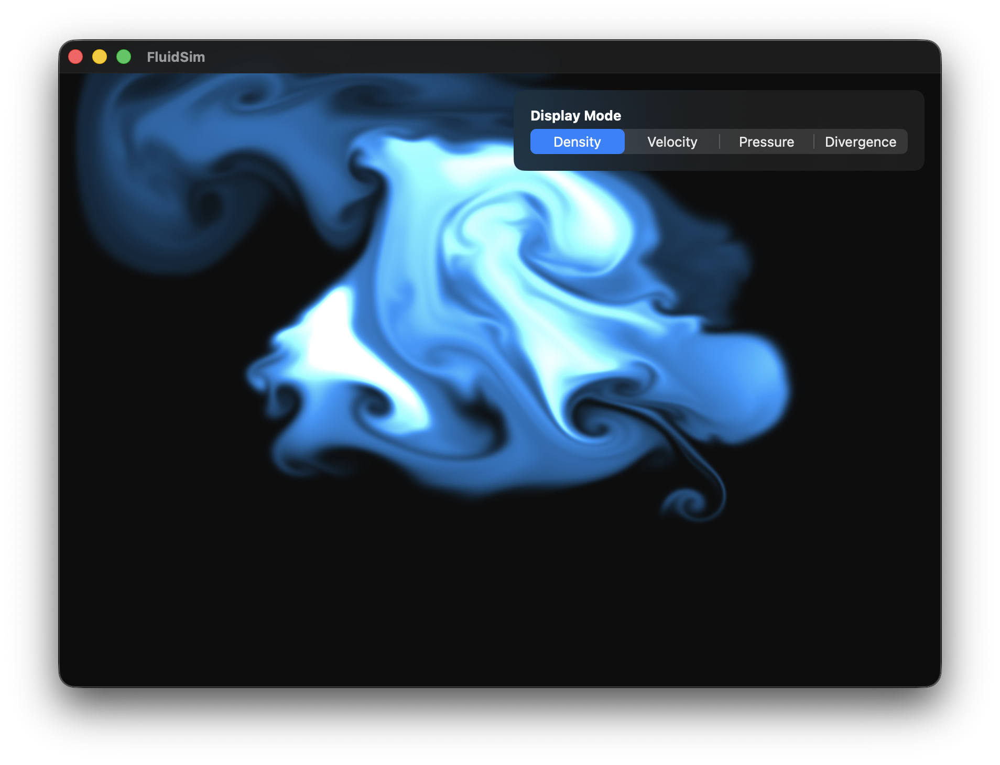
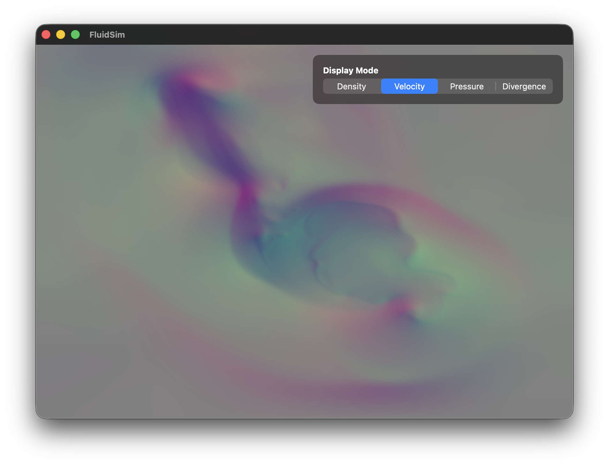

# FluidSim

Real-time fluid simulation implemented in **Metal**, based on Jos Stam's **Stable Fluids** algorithm with GPU-accelerated computation.

## Description

FluidSim is a 2D fluid dynamics simulator that allows real-time interaction by clicking and dragging the mouse. The fluid responds in real time with visual effects, and the entire simulation runs on the GPU via Metal compute shaders, achieving high performance even on large grids (base code runs 1024x1024).

### Features

- **Real-time simulation** on a 1024×1024 grid
- **Direct interaction** — drag on screen to inject fluid and create disturbances
- **Switchable visualization modes:**
  - **Density** — fluid density (fire/smoke style)
  - **Velocity** — velocity field (RG mapped to direction and magnitude)
  - **Pressure** — pressure field (grayscale: negative=blue, positive=red)
  - **Divergence** — field divergence (green/magenta for numerical debug)

## Inspiration & References

- **[Metal by Tutorials](https://www.kodeco.com/books/metal-by-tutorials)** (Kodeco) — rendering foundation and Metal window setup
- **[Stable Fluids](https://www.dgp.toronto.edu/public_user/stam/reality/Research/pdf/GDC03.pdf)** — Jos Stam — semi-Lagrangian advection and pressure projection algorithm
- **[GPU Gems, Chapter 38: Fast Fluid Dynamics Simulation on the GPU](https://developer.nvidia.com/gpugems/gpugems/part-vi-particle-system-and-simulation/chapter-38-fast-fluid-dynamics-simulation-gpu)** (NVIDIA) — GPU implementation; adapted for Metal

## Screenshots

| Density | Velocity | Pressure | Divergence |
|---------|----------|----------|------------|
|  |  |  |  |

## License

MIT